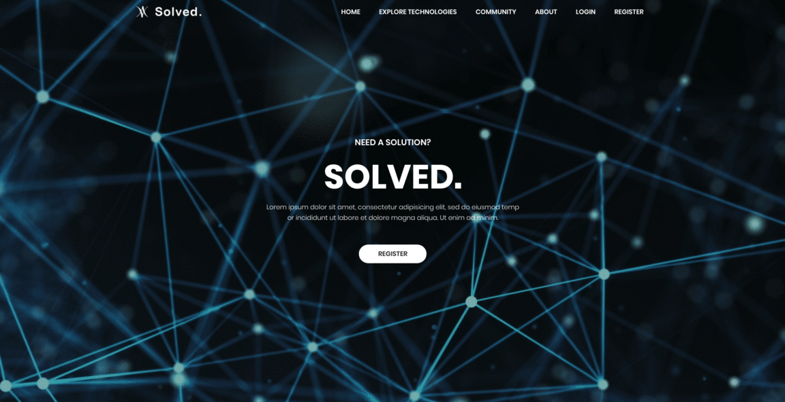

# Solved.

## Authors
* [Jasmine Quah](https://github.com/jasminequah)
* [Szymon Kobus](https://github.com/szymonkobus)

## About
This was a project produced over 6 weeks as part of Facebook's Hack-a-Project programme on the theme of "Bringing Communities Together". From the prompt, we wanted to identify problems which would benefit from bringing communities together. We saw that as people progress with their education and career, they tend to become specialised in a certain area or field, and do not have as many opportunities to learn about technologies and ideas outside of it.

This is a big problem, worsened by the difficulty of connecting with experts in other fields to learn more about it and discuss ideas. We believe this means that there is a lot of unfulfilled potential in different areas of technology and science, due to a lack of knowledge and cross-discipline discussion, especially in niche fields.

Solved. is a platform which strives to change this by connecting people from different fields, and enabling easier discovery of new technologies. Our users have the ability to start discussions to express ideas or interest, and get feedback from experts in that field, encouraging inter-disciplinary collaboration.



## Dependencies

This project was written using Node.js with an Express.js web framework, backed by MongoDB and using Jade/Pug as a HTML template engine.

Before running the web server, run the following command in the project root to fetch all dependencies via the node package manager. Dependencies are declared in `package.json`.

```shell
npm install
```

## Run (on localhost)

```shell
npm start
```

To view the web server, navigate to `localhost:3000`.

## Future Features and Extensibility

As this was created within a short timeframe as a proof of concept, we envision many future features and ways Solved. could be improved. These include:

* Better visualisation of technologies - implement a graph style visualisation of the links between different areas of technology. This will emphasize which areas may be less linked to other fields and draw attention to these, as they may have a lot of unexplored potential.
* Expert verification - allow user's credentials to be checked and displayed on their profile to give their posts more weighting in the community.
